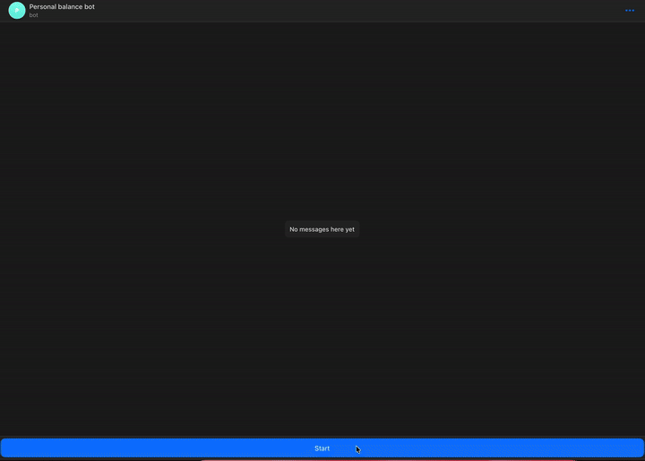

# Мои финансы

Личный трекер накоплений: приложение позволяет фиксировать баланс по каждому источнику хранения средств (банковская карта, наличные, счёт в другой валюте) и переводит его в единую валюту (EUR) по актуальному курсу для общей картины. Доступно как веб-приложение и как Telegram-бот с Mini App внутри Telegram.



## Что внутри

- **Категории** — вы создаёте категории для каждого источника хранения средств (например: наличные в KZT, карта в EUR, счёт в USD).
- **Баланс за день** — раз в день вы указываете текущую сумму по каждой категории. Бэкенд автоматически запрашивает курс валют и рассчитывает эквивалент в EUR. Одна категория — один снимок баланса за день: если запись за сегодня уже существует, повторная отправка не создаёт дубликат, а обновляет значение — как через веб-форму, так и через бота.
- **Таблица по датам** — сводная таблица за выбранный период с суммой по каждой категории и итогом по дню; любую запись можно отредактировать или удалить прямо в таблице.
- **Бот и Mini App в Telegram** — тот же функционал доступен из мессенджера: команда `/start` показывает кнопку запуска Mini App, а команды `/add` и `/balance` позволяют вносить и просматривать баланс, не открывая приложение.

## Архитектура

```
┌─────────────┐      ┌──────────────┐      ┌────────────┐
│   Frontend   │◄────►│   Backend    │◄────►│ PostgreSQL │
│  Vue 3 + Vite│      │   FastAPI    │      └────────────┘
└──────┬───────┘      └──────┬───────┘
       │                     │
       │              ┌──────▼───────┐      ┌──────────────────┐
       └─────────────►│  Telegram bot │─────►│ api.exchangerate. │
     (Mini App)        │python-telegram│      │  host (курсы)     │
                        │     -bot      │      └──────────────────┘
                        └──────────────┘
```

Все три сервиса и база данных развёрнуты в отдельных Docker-контейнерах и запускаются одной командой через `docker-compose`.

## Технологии

| Слой | Стек |
|---|---|
| Backend | Python, FastAPI, asyncpg, PostgreSQL |
| Frontend | Vue 3, Vite, axios, vue-router |
| Bot | python-telegram-bot 20, httpx |
| Миграции БД | [dbmate](https://github.com/amacneil/dbmate) |
| Инфраструктура | Docker, docker-compose |
| Авторизация API | общий bearer-токен (`Authorization: Bearer <token>`) |
| Курсы валют | [apilayer / exchangerate.host](https://apilayer.com/marketplace/exchangerates_data-api) |


## Запуск проекта

__Перед запуском необходимо установить зависимости.
Инструкции для каждой ОС приведены в файле
[INSTALL](./INSTALL.md)__.

Скопируйте `.env.example` в `.env` и заполните значения (ключ курсов валют, токен Telegram-бота, `API_AUTH_TOKEN` — общий секрет для авторизации запросов к API; подробности указаны в комментариях самого файла).

Чтобы запустить проект в первый раз, используйте команду:
(собираются и запускаются контейнеры, создаются таблицы в БД)

```bash
make build
```

Чтобы запустить уже собранные контейнеры, используйте команду:

```bash
make run
```

Чтобы остановить и удалить контейнеры, используйте команду:

```bash
make down
```

Веб-версия доступна по адресу http://localhost:7070. Бэкенд слушает http://localhost:8000 (все запросы требуют заголовок `Authorization: Bearer <API_AUTH_TOKEN>`).

### Демонстрация через Telegram

Чтобы кнопка «Открыть приложение» и сам Mini App работали корректно (Telegram должен иметь доступ и к фронтенду, и к бэкенду извне), требуется публичный HTTPS-туннель для обоих сервисов — например, [cloudflared](https://developers.cloudflare.com/cloudflare-one/connections/connect-networks/downloads/) (`cloudflared tunnel --url http://localhost:7070` и аналогично для `:8000`). Адреса туннелей указываются в `.env` (`WEBAPP_URL` — для фронтенда, `VITE_API_BASE_URL` — для бэкенда), после чего фронтенд и бэкенд необходимо пересобрать (`docker compose up -d --build`), чтобы новые значения применились. Бесплатные quick-туннели выдают новый адрес при каждом перезапуске, поэтому для постоянного использования рекомендуется именной туннель.

## Миграции

Чтобы создать новую пустую миграцию с заданным именем, используйте команду:

```bash
make create-empty-migration name=<имя>
```

Чтобы откатить последнюю применённую миграцию, используйте команду:

```bash
make downgrade
```

Чтобы узнать, в каком статусе миграции проекта, используйте команду:

```bash
make status
```

## API

Все эндпоинты бэкенда требуют заголовок `Authorization: Bearer <API_AUTH_TOKEN>`.

| Метод | Путь | Назначение |
|---|---|---|
| GET | `/categories/` | Список категорий |
| POST | `/categories/` | Создать категорию (`name`, `currency`) |
| DELETE | `/categories/{id}` | Удалить категорию (409, если есть связанные балансы) |
| GET | `/balances/?from_date&to_date` | Балансы за период, с конвертацией в EUR |
| POST | `/balance/` | Создать баланс(ы) на сегодня — список `{cat_id, value}` |
| PUT | `/balance/` | Изменить баланс за произвольную дату (`cat_id`, `date`, `value`) |
| PATCH | `/balance/` | Изменить баланс за сегодня, без указания даты (`cat_id`, `value`) |
| DELETE | `/balance/{id}` | Удалить конкретную запись баланса |

## Бот

- `/start` — приветственное сообщение с кнопкой «Открыть приложение», которая запускает Mini App.
- `/add` — пошагово: выбрать категорию → ввести сумму. Если запись за сегодня уже есть, обновляет её.
- `/balance` — баланс за сегодня; если записей ещё нет, предложит добавить через `/add`.
- `/cancel` — прервать `/add`.

## Что не сделано (осознанно, не забыто)

- Нет автоматических тестов и CI.
- Telegram Mini App не проверяет подпись `initData` — авторизация API держится на общем bearer-токене, а не на привязке к конкретному Telegram-пользователю.
- Проект не задеплоен на сервер — запускается только локально через Docker (см. раздел про демонстрацию через туннели выше).
- Сумма баланса (`Balance.value`) хранится как целое число без явной привязки к минимальным единицам валюты (копейки/тыины отдельно не поддерживаются).

## Лицензия

MIT, см. [LICENSE](./LICENSE).
